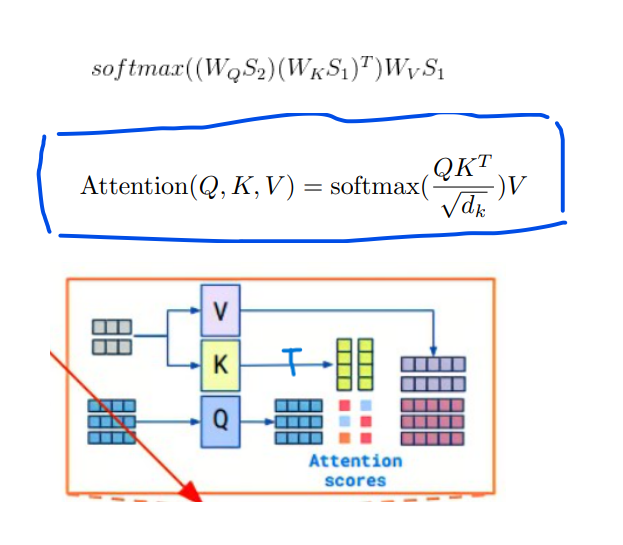

># May 2023

# 对于CV回顾和修正，以及Pytorch特性理解
## Con2D -->BatchNorm2d-->ReLU-->Pooling2D

 

>
>
* 符合中心极限定理，对batch的同一channel统计均值和标准差，随后修正使其符合标准正态分布 
  affine=true后，gamma和beta也可以反向传播
  >BatchNorm用于解决梯度爆炸/消失

卷积池化

* 对于stride=1,padding=1,kernel=3 
* 对于stride=1,padding=2,kernel=5 
* Con2D有分数时向下取整
* Pooling2D有分数时像上取整
* 没改变新feature_map大小
* 主要padding(int|tuple)和padding_mode(填充0，或者重复)

* dropout2D和dropout
* torch.nn.MaxPool2d  ~~VERSUS~~ torch.nn.functional.max_pool2d
  他们本质都是调用torch.nn.functional.max_pool2d，但是注意和Con2D默认为'1'不同的是pool2D的stride默认为kernel_size大小
* Broadly speaking we can think of the torch.nn layers as which contain trainable parameters while torch.nn.functional are purely functional
  
Tricks
* warmup 
  在warmup阶段使用较小的学习率(递增)
  在正式训练阶段使用较大的学习率(递减)
  
* Random Erasing Augmentation
  随机挖去训练图像的部分，增加模型泛化能力

* Label Smoothing
  对标签one-hot编码进行修正 
  '''
    [0，0，1，0，0，0]->[0.02，0.02，0.9，0.02，0.02，0.02]
  '''

## 对于目标追踪的理解
MOT multiple object tracking 目标追踪 联系匹配

* 通用评价标准 FP FN IDS(ID Switches)  
  MOTA MOTP IDF1 HOTA(High-order Tracking Acc) MT(Mostly Tracked trajectories)  
  ML(Mostly Lost trajectories)
* 主流评测数据集 MOTchallenge humaninevents BDD100K DanceTrack

## 大致方向
* 基于Tracking-by-detection的MOT 
  DeepSORT
* 基于Jointly learns the Detector and Embedding model  MOT 
   FairMOT
* 基于注意力机制的MOT  
   TrackFormer,TransCenter,MeMOT
## 特有名词
* 轨迹(Trajectory)。MOT系统的输出量，一条轨迹对应这一个目标在一个时间段内中的位置序列

* 小段轨迹(Tracklet)。 形成Trajectory过程中的轨迹片段。完整的Trajectory是由属于同一物理目标的Tracklets构成的
# DeepSORT
## 理论
>YoloV5生成bbox

>匈牙利算法 基于Reid iou构建代价矩阵完成tracks和bboxes的匹配

>基于卡尔曼滤波生成预测
1.it is such a general and powerful tool for combining information in the presence of uncertainty. 
2.The Kalman filter assumes that both variables (postion and velocity, in our case) are random and Gaussian distributed. Each variable has a mean value \(\mu\), which is the center of the random distribution (and its most likely state), and a variance \(\sigma^2\), which is the uncertainty:
 不同的信息源都存在误差 结合传感器观测值和模型预测值得到最优结果 

>代价矩阵(reid,iou,卡尔曼估计)

缺点：缺乏时空信息和运动信息

# Online Multiple Object Tracking with Cross-Task Synerg  
##  通过注意和分散解决occlusion

## 代码

 

# A Simple Baseline for Multi-Object Tracking(FairMOT)
##  1.Anchors don’t fit Re-ID

## 2.Multi-Layer Feature Aggregation

## 3.Dimensionality of the ReID Features

# 准备去看
## BERT GPT Transformer Jit JDE Attention

## 注意力机制
>key-query-value
> one-hot vs word embedding
> paf part affinity feild 怎么对向量打标签

# 总结
* 研究领域:MOT 
* 重点解决:occlusion and no-linear
* 论文偏好：提出想法innovative(有启发性)
* 方法需要具有:simple but effective

# 提出想法
sifter-Detecion
根据A Simple Baseline for Multi-Object Tracking中的观点，
anchor不适合生成Re-ID

* Embedding除了降维(仅保留主要特征)，还可以用来升维(强调原来笼统的特征)
对于发生occlusion的feature map,进行升维Embedding，突出被挡住的目标特征
再和卡尔曼滤波结合预测？

* 在模型中嵌入GAN网络动态生成质量更好的ReID

# May 12 2023 
## fasterRCNN
* 阅读论文和代码
* 训练模型
  >
## 训练环境
* pycharm professional远程部署 k80GPU with max memory 12G
* xshell基于tmux远程连接matpool
## 网络选择
* backbone： mobilenetv2
## 测试环境
* 本地pycharm 1060GPU with max memory 3G

## 代码上几个值得一提的三个细节
* RPNhead 共享参数于不同scale feature map
  >'and the regression
weights are shared by all region sizes.'
* 将 ROI_pooling 改成 RoIAlign
  >使用双线性插值代替之前的不均等划分
* `assign_targets_to_anchors`和 `assign_targets_to_proposals`
  
  `assign_targets_to_anchors ` 
  >根据 iou_threshold1( >0.7为目标 ) 计算每个anchors最匹配的gt，并将anchors进行分类，前景，背景以及废弃的anchors

  `assign_targets_to_proposals ` 
  >根据 iou_threshold2( >0.5为foreground ) 并为foreground划分样本的class_id

> records  matpool 解释器地址 /root/miniconda3/envs/myconda/bin/python

## 区别 degradation 和 overfitting
><b>degradation</b>  
类似于 fifo 算法中的 belady 现象，当增加网络层数时模型 accuracy 反而下降|增加页面数反而换出频率增加 
 `with the network depth increasing, accuracy gets saturated (which might be
unsurprising) and then degrades rapidly. Unexpectedly,
such degradation is not caused by overfitting` --res原文

><b>overfitting</b>  在训练时 loss 一直下降 accuracy增加，但是 test时 accuracy 效果不好

## 原理

1. 原始堆叠的组合(conv，BN，relu，pooling)可以视作input到潜在特征映射的非线性函数H(hypothesizes)

2. F(x)表示(input)与推理值H的残差，现在把(conv，BN，relu，pooling)视作Fx的模拟

3. 那么可以用F(x)+x等价原来的H(x)

## 细节
>

可知两点： 
1.任意一层都可以视作上面某一层的残差

2.反向传播中出现梯度消失的概率变小了

## 总结resNet
1.一种对于网络层数增加后的optimize手段

# NLP

常见一个英文单词的编码方式
* one-hot Encoding
apple=[1,0,0,0,...],其中每个vector的长度相等且等于所有单词的数目 
vector不能反映单词之间的信息

* word Embedding
  
 同类词的vector编码之间有信息

# <b>attention</b>
关于`self.attention`很重要的概念
q(Wq),k(Wk),v(Wv),attention_matrix

* 把每一个要处理的单词序列分别编码为一个vector 
  该vector应该包含单词本身信息和位置信息 
  如wordEmbedding+posEncoding相加
 

* X分别与Wq,WK,WV矩阵乘法，得到矩阵Q,W,V目的是产生可以学习的参数
 

* Q，transpose(T)进行矩阵乘，得到attention_matrix,其中每一行表示当前行的单词和所有对应列单词的关注度
 

* attention_matrix每行softmax
 

* a_matrix和V矩阵乘的本质
  新矩阵Z的某一个行其实是原来V每一个不同权重的和
   
   
  
## multi-head attention
   

## cross-attention
* 在corss-attention中，attention矩阵 rows和columns不必相等
   
## detr
   

 
 ## layerNorm vs batchNorm

 layerNorm对同一batch
    

## 在阅读了vis Transformer，重新回顾实现的transformer问题... 
效果不好的原因可能有：

* 没有在模型输入时编码图像的位置信息，也没有加上cls token
  
* crop图像为4个区域后后直接reshape成4个1维向量，而不是用FC，从而丢失了图像局部特征的联系
  
* 模型使用了 decoder x2，而vis transformer没有用
* 最后的矩阵直接使用 max( cumsum( dim=0 ) )，而不是取cls token对应一行做分类

* mnist数据集单一且少且模型没有预训练学习先验信息

## 预备和思考
* <b>看目标检测detr,swin-Transformer,MAE,SimMIM,Beit</b>

* <b>transformer到无监督的目标检测领域</b> 
  1.传统目标检测都需要label box标记 

  2.但是同一个数据集的图像直接已经有一定的相似性(譬如行人检测说都有汽车) 

  3.使用一个transformer结合卷积学习不同图片的相同的特征或许可行 
* <b>tranformer可以用来做图像生成+小样本？</b> 
  1.譬如说可以对不同层数的特征图赋予一个可以学习的权重 
  
  2.加权融合特征图，或许能增加图像生成的质量

May 29,2023
## Tensor混淆的地方

  
<b>*dim=0* 始终在最外围</b>
 
 <b>单层感知机</b>
 
 <b>单层感知机的数学原理就是用多个简单的 `y=wx+b`组成复杂的函数</b>

 ## save&load model
  

## **python class 三种继承**
  
 `python dataset使用第二个` 
 如果你实现了自己的__init__()就会覆盖父类的__init__(),除非你在实现自己的方法同时也显式调用父类方法
 `model-nn module使用第三个`

 ## **学习率的设置策略**
   
  * 过高的学习率会导致梯度爆炸
  * 高的学习率导致收敛效果不理想

  

  
  
  

